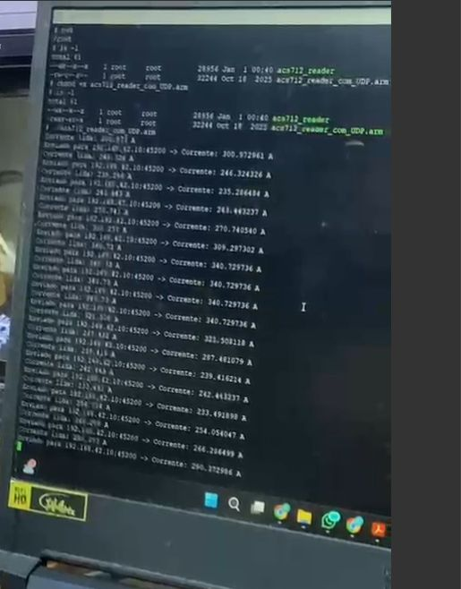
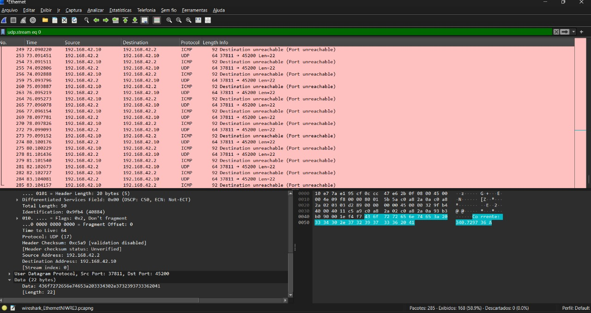

# Leitura de Corrente com Sensor ACS712 na STM32MP1 DK1

## 📌 Descrição Geral do Projeto
Este projeto tem como objetivo implementar a leitura de corrente elétrica em **circuitos externos** utilizando o **sensor analógico ACS712**, integrado a uma **placa STM32MP1 DK1** com Linux embarcado.  

O sensor ACS712 converte a corrente medida em uma saída analógica proporcional, que é lida pelo conversor ADC presente na STM32MP1. Para processar esses dados, foi desenvolvido um **código em C++**, que realiza a aquisição contínua dos valores via interface **sysfs (IIO)**, converte para ampères considerando a sensibilidade do sensor e exibe os resultados no terminal.  

A compilação é feita em ambiente **WSL (Windows Subsystem for Linux)**, utilizando **compilação cruzada (cross-compilation)** para gerar um executável compatível com a arquitetura ARM da placa. Esse executável é então transferido e executado na STM32MP1, permitindo monitorar em tempo real as correntes consumidas por outros dispositivos eletrônicos conectados ao sensor.

---

## ⚙️ Dependências Necessárias
Para compilar e executar este projeto, são necessários:

- **Compilador cruzado ARM** (exemplo: `arm-linux-gnueabihf-g++`)
- Ambiente Linux embarcado configurado na **STM32MP1 DK1**
- Toolchain específica: `arm-buildroot-linux-gnueabihf_sdk-buildroot.tar.gz`

---

## 🛠️ Estrutura do Código
O código principal está em `acs712_reader.cpp`, implementado da seguinte forma:

### Classe `ACS712`
- **Responsabilidade**: Leitura dos valores do ADC via sysfs e conversão para corrente (A).
- **Principais métodos**:
  - `ACS712(int channel, float sensitivity_mV_per_A)`: construtor que recebe o canal IIO e a sensibilidade do sensor.
  - `float readCurrent()`: realiza a leitura do valor bruto do ADC, converte em tensão (mV), aplica offset (~2.5V) e calcula a corrente em ampères.
  - `int readIntFromFile(const std::string &path)`: função auxiliar que lê valores inteiros de arquivos no sysfs.

### Função `main()`
- Cria uma instância da classe `ACS712` no **canal 13** com sensibilidade de **185 mV/A (ACS712-5A)**.
- Lê continuamente os valores de corrente a cada 100 ms.
- Imprime os resultados no terminal.

---

## ▶️ Instruções de Compilação e Execução

### 1. Clonar o Repositório
```bash 
git clone [URL_DO_SEU_REPOSITORIO_AQUI]
cd [NOME_DO_SEU_REPOSITORIO]
```
### 2. Configurar o Ambiente de Compilação
```
tar -xvf arm-buildroot-linux-gnueabihf_sdk-buildroot.tar.gz
````
### 3. Compilar o Código (Cross-Compilation)
```
arm-linux-gnueabihf-g++ acs712_reader.cpp -o acs712_reader
```
### 4. Transferir o Executável para a Placa
```
scp acs712_reader root@192.168.42.2:/root/
````
### 5. Acessar a Placa via SSH
```
ssh root@192.168.42.2
```
### 6. Executar o Programa na STM32MP1 DK1
```
cd /root
./acs712_reader
```
# Exemplo do programa rodando na placa:


### 6. Sistema Embarcado: Procedimentos de Verificação e Comunicação UDP

Este tutorial aborda a implementação e validação do Cliente na Placa Embarcada, cuja função é transmitir leituras do sensor para o Host Windows (192.168.42.10:8080).

#### 6.1. Definições de Rede Cruciais

Cliente e Servidor (Host Windows) precisam compartilhar a mesma sub-rede para estabelecer comunicação:

| Componente | Endereço IP | Porta UDP | Referência no Código do Cliente |
| :--- | :--- | :--- | :--- |
| *Cliente* (Placa Embarcada) | 192.168.42.2 | 8080 (Saída) | Configurado para enviar para 192.168.42.10 |
| *Servidor* (Windows Host) | 192.168.42.10 | 8080 (Entrada) | Alvo dos pacotes UDP. |

#### 6.2. Operação do Cliente

1.  *Compilação:* Compile o arquivo clienteUDP_sensor_ldr.cpp na Placa Embarcada (ambientes Linux/POSIX). As correções de conversão já foram implementadas.
2.  *Ativação:* Execute o Cliente na Placa. O sistema iniciará o envio de pacotes UDP em intervalos de um segundo para o Host Windows.
    ```bash
    ./clienteUDP_sensor_ldr
    ```
    Comportamento esperado: O terminal da Placa exibirá mensagens confirmando o envio para 192.168.42.10:8080.

#### 6.3. Verificação do Envio de Dados (Utilitários de Rede)

Para confirmar se os pacotes do Cliente estão sendo transmitidos pela Placa e alcançando a interface de rede do Windows, utilize ncat.exe, Wireshark ou um Programa Servidor de coleta.

##### 6.3.1. Verificação com ncat (Teste de Captura)
    
O ncat atua como um "servidor de verificação" básico para confirmar se os pacotes atravessam o Firewall.
    
1.  *No PowerShell/CMD do Windows Host* (diretório do ncat.exe):
    ```powershell
    .\ncat.exe -ulnv 8080
    ```
    Este comando aguarda (-l) conexões UDP (-u) na porta 45200 com modo detalhado (-v).
2.  *Ative o Cliente* na Placa.

###### Interpretação do Resultado do ncat:

| Comportamento do ncat (Windows Host) | Diagnóstico | Medida Corretiva |
| :--- | :--- | :--- |
| *Captura os dados (ex: '45', '100')* | Cliente operando corretamente e rede funcional. | O problema está restrito ao código/compilação do Servidor C++. |
| *NÃO captura dados* | O pacote está sendo bloqueado antes de alcançar o aplicativo. | *Próximo passo:* Vá para a Seção 6.3.3 (Firewall/Wireshark). |

##### 6.3.2. Verificação com Wireshark (Teste de Recepção)
    
O Wireshark confirma se o pacote UDP está efetivamente chegando à *interface de rede* do Windows (192.168.42.10).
    
1.  *No Windows Host:* Abra o Wireshark.
2.  Selecione a *Interface de Rede* com o IP 192.168.42.10.
3.  Aplique o filtro: `udp and port 8080`.
4.  *Inicie o Cliente* na Placa.

###### Análise do Wireshark:

* *Se o Wireshark EXIBIR os pacotes:* A transmissão está alcançando o Windows. O Firewall do Windows está impedindo a entrega ao ncat (ou Servidor).
* *Se o Wireshark NÃO EXIBIR os pacotes:* A transmissão não está partindo da Placa ou existe uma falha de conectividade física (cabos/configurações de IP).

##### 6.3.3. Resolução do Firewall (Se Pacote Chegar, mas ncat Bloquear)
    
Caso o Wireshark detecte os pacotes, mas o ncat não os receba:
    
1.  *Desabilitação Temporária:* Desative temporariamente o Firewall do Windows Host. Se a comunicação for estabelecida, o Firewall é a causa.
2.  *Solução Permanente:* Crie uma regra de Firewall de *Entrada (Inbound)* para o protocolo *UDP* na porta *8080*.

##### 6.3.4. Desenvolvimento de um Servidor de Recebimento
    
Para uma solução de monitoração contínua no Host Windows, desenvolva um servidor UDP simples em C, C++ ou Python.
    
| Linguagem | Vantagens | Biblioteca Principal |
| :--- | :--- | :--- |
| *Python* | Ideal para prototipagem ágil e visualização. | socket |
| *C/C++* | Máximo desempenho e controle granular. | Windows Sockets (winsock2.h) |

O servidor deve:
    
1.  Criar um socket UDP (SOCK_DGRAM).
2.  Vincular (bind) o socket ao endereço 192.168.42.10 (ou 0.0.0.0) e à porta 8080.
3.  Entrar em um loop contínuo, utilizando recvfrom() ou similar para aguardar os datagramas do Cliente.
4.  Converter os dados recebidos (string/ASCII) de volta para valores numéricos para análise.


# Exemplo do programa rodando na placa:


# Exemplo do programa rodando na placa:
 
  Esta foto está borrada, como já falado pessoalmente, e para nao ser necessario montar todo o circuito novamente a estou enviando. Nela encontrasse a mesma porta vista na foto que contem os pacotes UDP porta: 45200 comprovando que que a leitura no terminal é a mesma feita no wireshark
