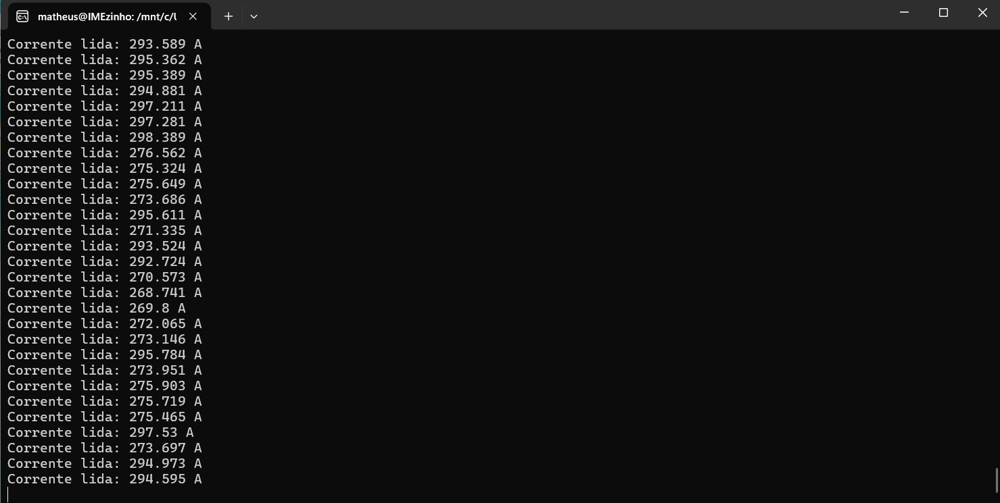

# Leitura de Corrente com Sensor ACS712 na STM32MP1 DK1

## 📌 Descrição Geral do Projeto
Este projeto tem como objetivo implementar a leitura de corrente elétrica em **circuitos externos** utilizando o **sensor analógico ACS712**, integrado a uma **placa STM32MP1 DK1** com Linux embarcado.  

O sensor ACS712 converte a corrente medida em uma saída analógica proporcional, que é lida pelo conversor ADC presente na STM32MP1. Para processar esses dados, foi desenvolvido um **código em C++**, que realiza a aquisição contínua dos valores via interface **sysfs (IIO)**, converte para ampères considerando a sensibilidade do sensor e exibe os resultados no terminal.  

A compilação é feita em ambiente **WSL (Windows Subsystem for Linux)**, utilizando **compilação cruzada (cross-compilation)** para gerar um executável compatível com a arquitetura ARM da placa. Esse executável é então transferido e executado na STM32MP1, permitindo monitorar em tempo real as correntes consumidas por outros dispositivos eletrônicos conectados ao sensor.

---

## ⚙️ Dependências Necessárias
Para compilar e executar este projeto, são necessários:

- **Compilador cruzado ARM** (exemplo: `arm-linux-gnueabihf-g++`)
- Ambiente Linux embarcado configurado na **STM32MP1 DK1**
- Toolchain específica: `arm-buildroot-linux-gnueabihf_sdk-buildroot.tar.gz`

---

## 🛠️ Estrutura do Código
O código principal está em `acs712_reader.cpp`, implementado da seguinte forma:

### Classe `ACS712`
- **Responsabilidade**: Leitura dos valores do ADC via sysfs e conversão para corrente (A).
- **Principais métodos**:
  - `ACS712(int channel, float sensitivity_mV_per_A)`: construtor que recebe o canal IIO e a sensibilidade do sensor.
  - `float readCurrent()`: realiza a leitura do valor bruto do ADC, converte em tensão (mV), aplica offset (~2.5V) e calcula a corrente em ampères.
  - `int readIntFromFile(const std::string &path)`: função auxiliar que lê valores inteiros de arquivos no sysfs.

### Função `main()`
- Cria uma instância da classe `ACS712` no **canal 13** com sensibilidade de **185 mV/A (ACS712-5A)**.
- Lê continuamente os valores de corrente a cada 100 ms.
- Imprime os resultados no terminal.

---

## ▶️ Instruções de Compilação e Execução

### 1. Clonar o Repositório
```bash 
git clone [URL_DO_SEU_REPOSITORIO_AQUI]
cd [NOME_DO_SEU_REPOSITORIO]
```
### 2. Configurar o Ambiente de Compilação
```
tar -xvf arm-buildroot-linux-gnueabihf_sdk-buildroot.tar.gz
````
### 3. Compilar o Código (Cross-Compilation)
```
arm-linux-gnueabihf-g++ acs712_reader.cpp -o acs712_reader
```
### 4. Transferir o Executável para a Placa
```
scp acs712_reader root@192.168.42.2:/root/
````
### 5. Acessar a Placa via SSH
```
ssh root@192.168.42.2
```
### 6. Executar o Programa na STM32MP1 DK1
```
cd /root
./acs712_reader
```
# Exemplo do programa rodando na placa:


